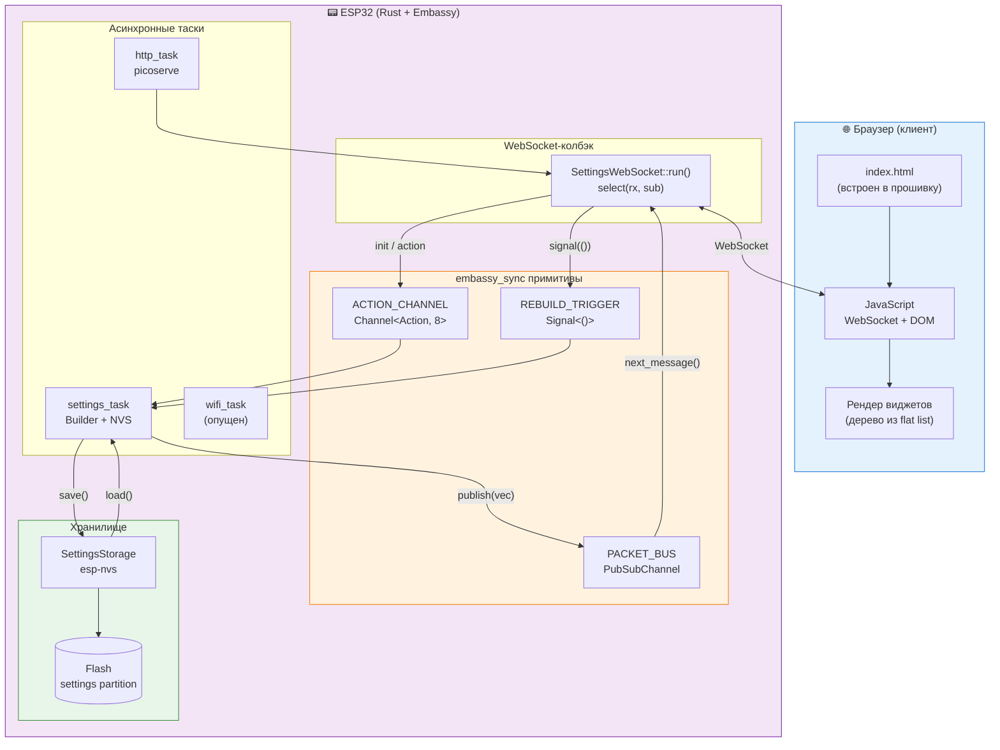
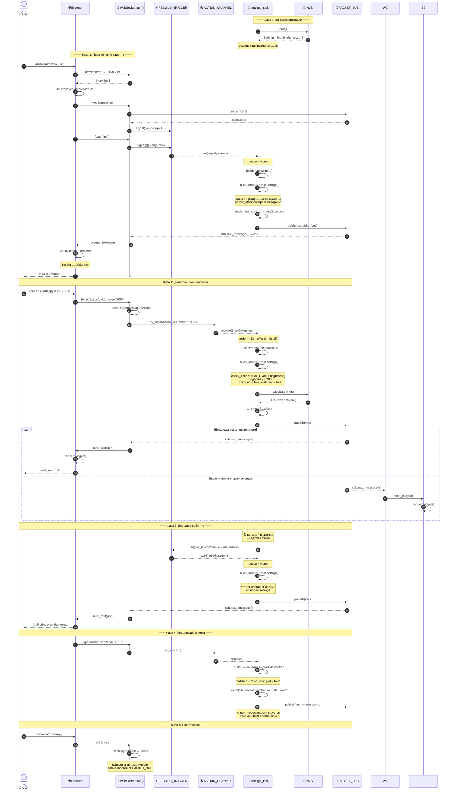

```mermaid
graph TB
    subgraph Browser["🌐 Браузер (клиент)"]
        HTML["index.html<br/>(встроен в прошивку)"]
        JS["JavaScript<br/>WebSocket + DOM"]
        UI["Рендер виджетов<br/>(дерево из flat list)"]
        HTML --> JS --> UI
    end

    subgraph ESP32["📟 ESP32 (Rust + Embassy)"]
        subgraph Tasks["Асинхронные таски"]
            HTTP["http_task<br/>picoserve"]
            SETTINGS["settings_task<br/>Builder + NVS"]
            WIFI["wifi_task<br/>(опущен)"]
        end

        subgraph WS["WebSocket-колбэк"]
            RUN["SettingsWebSocket::run()<br/>select(rx, sub)"]
        end

        subgraph Sync["embassy_sync примитивы"]
            ACTION["ACTION_CHANNEL<br/>Channel&lt;Action, 8&gt;"]
            TRIGGER["REBUILD_TRIGGER<br/>Signal&lt;()&gt;"]
            BUS["PACKET_BUS<br/>PubSubChannel"]
        end

        subgraph Storage["Хранилище"]
            NVS["SettingsStorage<br/>esp-nvs"]
            FLASH[("Flash<br/>settings partition")]
            NVS --> FLASH
        end

        HTTP --> RUN
        RUN -->|"init / action"| ACTION
        RUN -->|"signal(())"| TRIGGER
        ACTION --> SETTINGS
        TRIGGER --> SETTINGS
        SETTINGS -->|"publish(vec)"| BUS
        SETTINGS -->|"save()"| NVS
        NVS -->|"load()"| SETTINGS
        BUS -->|"next_message()"| RUN
    end

    RUN <-->|"WebSocket"| JS

    style Browser fill:#e3f2fd,stroke:#1976d2
    style ESP32 fill:#f3e5f5,stroke:#7b1fa2
    style Sync fill:#fff3e0,stroke:#f57c00
    style Storage fill:#e8f5e9,stroke:#388e3c
```

```mermaid
sequenceDiagram
    autonumber

    actor U as 👤 User
    participant B as 🌐 Browser
    participant W as 🔌 WebSocket::run()
    participant T as ⚡ REBUILD_TRIGGER
    participant A as 📥 ACTION_CHANNEL
    participant S as 🧠 settings_task
    participant N as 💾 NVS
    participant BUS as 📡 PACKET_BUS

    Note over S,N: ─── Фаза 0: Загрузка прошивки ───
    S->>N: load()
    N-->>S: Settings { led, brightness, ... }
    Note over S: settings кэшируются в static

    Note over B,W: ─── Фаза 1: Подключение клиента ───
    U->>B: открывает страницу
    B->>W: HTTP GET / → HTML+JS
    W-->>B: index.html
    B->>B: JS стартует, открывает WS
    B->>W: WS handshake
    activate W

    W->>BUS: subscriber()
    BUS-->>W: subscriber #1

    W->>T: signal(()) «собери UI»
    B->>W: {type:"init"}
    W->>T: signal(()) «ещё раз»

    T-->>S: wait() пробуждение
    activate S

    Note over S: action = None

    S->>S: Builder::new(None)
    S->>S: build(&mut b, &mut settings)
    Note over S: packet = [Toggle, Slider, Group...]<br/>parent_stack собирает иерархию

    S->>S: serde_json_core::to_string(&packet)
    S->>BUS: publisher.publish(vec)
    deactivate S

    BUS-->>W: sub.next_message() → vec
    W->>B: tx.send_text(json)
    B->>B: JSON.parse + render()
    Note over B: flat list → DOM tree
    B-->>U: ✅ UI отображён

    deactivate W

    Note over U,BUS: ─── Фаза 2: Действие пользователя ───
    U->>B: клик по слайдеру id=1 → 200
    B->>W: {type:"action", id:1, value:"200"}
    activate W
    W->>W: parse ClientMessage::Action
    W->>A: try_send(Action {id:1, value:"200"})
    deactivate W

    A-->>S: receive() пробуждение
    activate S

    Note over S: action = Some(Action {id:1})

    S->>S: Builder::new(Some(action))
    S->>S: build(&mut b, &mut settings)
    Note over S: check_action::<u8>(1, &mut brightness)<br/>→ brightness = 200<br/>→ changed = true, matched = true

    S->>N: save(&settings)
    N-->>S: OK (blob записан)

    S->>S: to_string(&packet)
    S->>BUS: publish(vec)
    deactivate S

    par Broadcast всем подписчикам
        BUS-->>W: sub.next_message()
        W->>B: send_text(json)
        B->>B: render(widgets)
        B-->>U: слайдер = 200
    and Если открыта вторая вкладка
        BUS-->>W2: sub.next_message()
        W2->>B2: send_text(json)
        B2-->>B2: render(widgets)
    end

    Note over U,BUS: ─── Фаза 3: Внешнее событие ───
    Note over S: ⏰ таймер / 📊 датчик<br/>из другого таска
    S->>T: signal(()) «состояние изменилось»
    T-->>S: wait() пробуждение
    activate S

    Note over S: action = None

    S->>S: build(&mut b, &mut settings)
    Note over S: читает свежие значения<br/>из полей settings

    S->>BUS: publish(vec)
    deactivate S

    BUS-->>W: sub.next_message()
    W->>B: send_text(json)
    B-->>U: 🔄 UI обновлён без клика

    Note over U,BUS: ─── Фаза 4: Устаревший клиент ───
    B->>W: {type:"action", id:99, value:"..."}
    activate W
    W->>A: try_send(...)
    deactivate W

    A-->>S: receive()
    activate S
    S->>S: build() — ни один виджет не совпал
    Note over S: matched = false, changed = false

    S->>S: warn!("Action not matched — stale client")
    S->>BUS: publish(vec) — всё равно
    deactivate S

    Note over S: Клиент пересинхронизируется<br/>с актуальным состоянием

    Note over U,BUS: ─── Фаза 5: Отключение ───
    U->>B: закрывает вкладку
    B->>W: WS Close
    activate W
    W->>W: Message::Close → break
    deactivate W
    Note over W: subscriber автоматически<br/>отписывается от PACKET_BUS
```